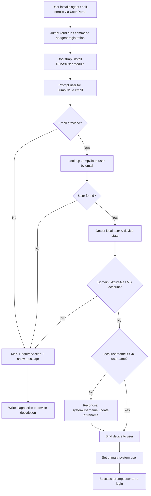
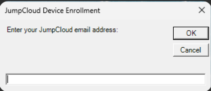
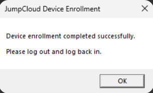

<div align="center">

# JumpCloud Onboarding Toolkit

**Automation scripts that make customer onboarding to JumpCloud faster, safer, and nearly hands-free.**

[](https://learn.microsoft.com/powershell/)
[](#prerequisites)
[](https://jumpcloud.com/)
[](LICENSE)
[](#roadmap)

</div>

---

## Overview

Onboarding a customer's fleet to JumpCloud usually means an admin manually touching every
device — matching local accounts to JumpCloud identities, binding systems, and setting the
primary user one by one. It's slow, error-prone, and doesn't scale.

This toolkit replaces that manual work with **self-service, MDM-dispatched automation**. An
end user installs the agent, answers one prompt, and their device is correctly bound to
their JumpCloud identity — with full logging and graceful handling of the messy real-world
states devices show up in.

> **The result:** a complicated, multi-step per-device process that normally takes about half
> an hour becomes a roughly one-minute, user-driven action.

---

## Table of Contents

- [Highlights](#highlights)
- [What's in the toolkit](#whats-in-the-toolkit)
- [How it works](#how-it-works)
- [What the user sees](#what-the-user-sees)
- [Repository structure](#repository-structure)
- [Prerequisites](#prerequisites)
- [Deployment](#deployment)
- [Configuration](#configuration)
- [Output & logging](#output--logging)
- [Roadmap](#roadmap)
- [License](#license)

---

## Highlights

- 🔗 **Automatic account takeover & binding** — links the existing local Windows account to the
  correct JumpCloud user with no manual admin lookup.
- 🧠 **Smart username reconciliation** — aligns the local Windows username with the JumpCloud
  username via a `systemUsername` update → local rename fallback chain.
- 🛡️ **Safe-by-default guardrails** — refuses to run on domain-joined, Azure AD-joined, or
  Microsoft-account devices to avoid breaking managed machines.
- 👤 **Friendly end-user experience** — a simple input box for the email and a clear result
  dialog, shown in the logged-in user's session via `RunAsUser`.
- 📝 **Full audit trail** — timestamped logging plus failure diagnostics written back to the
  device's JumpCloud description for easy triage.
- ⚙️ **Self-bootstrapping** — installs its own prerequisites (NuGet provider, `RunAsUser`
  module) so it runs cleanly on a fresh device.

---

## What's in the toolkit

| Script | Platform | What it solves | Time saved |
|--------|----------|----------------|------------|
| [`Invoke-DeviceEnrollment.ps1`](scripts/device-enrollment/windows/Invoke-DeviceEnrollment.ps1) | Windows (PowerShell) | Takes over the local account and binds the device to the correct JumpCloud user during enrollment | Replaces a manual, multi-step per-device admin task with a roughly one-minute, user-driven action |

> _More scripts (macOS / Bash) are on the [roadmap](#roadmap) — this toolkit is built to grow._

---

## How it works

`Invoke-DeviceEnrollment.ps1` is dispatched as a JumpCloud Command that runs automatically
when the agent registers on the device — whether the user installs the agent directly or
self-enrolls through the JumpCloud User Portal. From there it runs through a guarded,
fail-safe pipeline: each stage only proceeds if the previous one succeeded, and any failure
is captured, surfaced to the user, and logged back to the device record.



---

## What the user sees

The entire experience for the end user is two simple dialogs — enter an email, then confirm.

<div align="center">

| Step 1 — Enter email | Step 2 — Success |
|:---:|:---:|
|  |  |

</div>

---

## Repository structure

```
jumpcloud-onboarding-toolkit/
├── README.md
├── LICENSE
├── .gitignore
├── docs/
│   └── screenshots/          # add UI / result screenshots here
└── scripts/
    └── device-enrollment/
        └── windows/
            └── Invoke-DeviceEnrollment.ps1
```

---

## Prerequisites

- A Windows device **managed by JumpCloud** (enrolled agent / MDM).
- A JumpCloud **API key** with permission to:
  - read system users (`GET /systemusers`)
  - update system users (`PUT /systemusers/{id}`)
  - create user↔system associations (`POST /v2/users/{id}/associations`)
  - update systems (`PUT /systems/{id}`)
- PowerShell **5.1+** (ships with Windows 10/11).
- The script must run with **administrative / SYSTEM** rights (it installs modules for all
  users and may rename a local account). The `RunAsUser` module is installed automatically.
- The device must **not** be domain-joined, Azure AD-joined, or signed in with a Microsoft
  account — these are intentionally blocked.

---

## Deployment

This script is designed to be dispatched from JumpCloud as a **Command** (run as `System`)
targeting Windows devices.

1. In the JumpCloud Admin Console, create a new **Command** with the trigger set to **after
   Agent Install** → **Windows** → select the **PowerShell** checkbox.
2. Paste the contents of
   [`Invoke-DeviceEnrollment.ps1`](scripts/device-enrollment/windows/Invoke-DeviceEnrollment.ps1).
3. Provide the required value for the configuration placeholder (see
   [Configuration](#configuration)).
4. Install the JumpCloud agent on the target device(s). The end user will see an email prompt,
   then a result dialog when it finishes.

---

## Configuration

Only one placeholder needs to be supplied — the device ID is provided automatically by
JumpCloud:

```powershell
$JC_API_KEY = {{Apikey}}      # your JumpCloud API key
```

- **`{{Apikey}}`** — an **Automation Variable** that a JumpCloud admin must create in the
  Admin Console. JumpCloud substitutes it at dispatch time, so the real key never lives in
  source.
- **`{{device.id}}`** — already referenced in the script and resolved **automatically** by
  JumpCloud Commands (a built-in command variable); no setup required.

> ⚠️ **Never commit a real API key.** Use a JumpCloud **Automation Variable** instead, so the
> key is injected only at dispatch time.

---

## Output & logging

The script writes to `C:\Users\Public\Documents\`:

| File | Purpose |
|------|---------|
| `jc_device_bind.log` | Timestamped execution log of every step |
| `jc_email.txt` | The email the user entered (transient input) |
| `jc_result.txt` | The message shown in the final result dialog |

On failure, a one-line diagnostic summary (binding status, issue, device state, local/JC user,
email) is written to the device's **description** field in JumpCloud for quick triage. A
single-line status summary is also emitted to the command output for visibility in the console.

---

## Roadmap

- [ ] macOS enrollment script (Bash)
- [ ] Windows enrollment script (Bash / cross-shell variant)
- [ ] Additional onboarding utilities (group assignment, app provisioning)
- [ ] Usage screenshots and walkthrough GIFs

---

## License

Released under the [MIT License](LICENSE).

---

<div align="center">

Built to make JumpCloud onboarding effortless. ⚡

</div>
